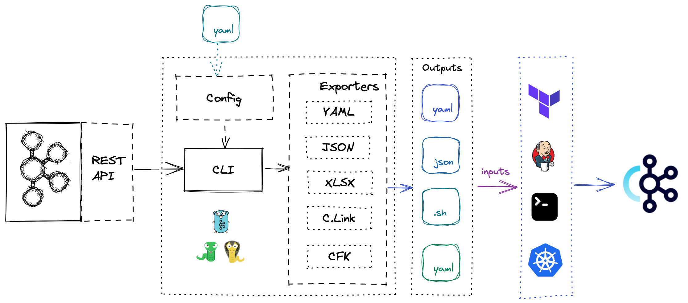

# Confluent Migration Tools

`cctool` is command Line tool for helping on migrations to Confluent Cloud or Confluent Platform.

This CLI uses Kafka client and REST APIs to extract and export all the resources from the Source cluster in order to replicate them on the target cluster. It was tested with Confluent Platform and Confluent Cloud clusters.

It allows to export resources into different formats, that could be used as input for different tools like Confluent Cloud, Terraform, Confluent For Kubernetes or any other tool.



## Installation

Go to [Releases](https://github.com/mcolomerc/cctools/releases) and Download your OS distribution.

## Usage

### Export

Export Topics and Schemas.

`cctools export --help`

```sh
Command to export cluster information.

Usage:
  cctools export [flags]
  cctools export [command]

Aliases:
  export, export-info, cluster-export, confluent-exp, exp

Available Commands:
  schemas     Export Schemas Info
  topics      Export Topics Info

Flags:
  -h, --help            help for export
  -o, --output string   Output format. Possible values: json, yaml, hcl, cfk, clink

Global Flags:
  -c, --config string   config file (default is $HOME/.config.yaml)

Use "cctools export [command] --help" for more information about a command.
```

**Configuration**:

- Source Kafka cluster connection 
- `output` path.
- Exporter configuration:
  - Specific configuration for each exporter (See Exporters)
 
Example for Confluent Cloud:

```sh
source: 
  bootstrapServer: <BOOTSTRAP_SERVER>.confluent.cloud:9092
  clientProps:
    - sasl.mechanisms: PLAIN
    - security.protocol: SASL_SSL
    - sasl.username: <CONFLUENT_CLOUD_API_KEY>
    - sasl.password: <CONFLUENT_CLOUD_API_SECRET>
export:  
  output: output #Output Path
export: 
  topics:
    exclude: _confluent 
```

Export format:

- JSON: `cctools export --output json --config config.yaml`
- YAML: `cctools export --output yaml --config config.yaml`
- CFK(YML): `cctools export --output cfk --config config.yaml`
- CLINK(SH): `cctools export --output clink --config config.yaml`
- HCL(TFVARS): `cctools export --output hcl --config config.yaml`

### Export Topics command

`cctools export topics --help`

```sh
 Command to export Topics information.

Usage:
  cctools export topics [flags]

Aliases:
  topics, topic-info, topic-exp, tpc

Flags:
  -h, --help   help for topics

Global Flags:
  -c, --config string   config file (default is $HOME/.config.yaml)
  -o, --output string   Output format. Possible values: json, yaml, hcl, cfk, clink
```

Configuration:

- Source Kafka coonnection
- Output path
- Exporter configuration:
  - Specific configuration for each exporter (See Exporters)

`--config`

Configuration (config.yml)

Using Topic Exporter Configuration to exclude some topics.

All topics names containing `_confluent` will be excluded.

```yaml
export: 
  topics:
    exclude: _confluent 
```

config.yml:

```yaml
source: 
  bootstrapServer: <BOOTSTRAP_SERVER>.confluent.cloud:9092
  clientProps:
    - sasl.mechanisms: PLAIN
    - security.protocol: SASL_SSL
    - sasl.username: <CONFLUENT_CLOUD_API_KEY>
    - sasl.password: <CONFLUENT_CLOUD_API_SECRET>
export: 
  topics:
    exclude: _confluent 
  output: output #Output Path
```

`--output`

Output format:

- JSON: `cctools export topics --output json --config config.yaml`
- YAML: `cctools export topics --output yaml --config config.yaml`
- CFK(YML): `cctools export topics --output cfk --config config.yaml`
- CLINK(SH): `cctools export topics --output clink --config config.yaml`
- HCL(TFVARS): `cctools export topics --output hcl --config config.yaml`

---

### Export Schemas

`cctools export schemas --help`

```sh
 Command to export Schemas information.

Usage:
  cctcctools export schemas [flags]

Aliases:
  schemas, schemas-info, schemas-exp, schema

Flags:
  -h, --help   help for schemas

Global Flags:
  -c, --config string   config file (default is $HOME/.config.yaml)
  -o, --output string   Output format. Possible values: json, yaml, hcl, cfk, clink
```

Output format:

- JSON: `cctools export schemas --output json --config config.yaml`
- YAML: `cctools export schemas --output yaml --config config.yaml`
- CFK(YML): `cctools export schemas --output cfk --config config.yaml`
- CLINK(SH): `cctools export schemas --output clink --config config.yaml`
- HCL(TFVARS): `cctools export schemas --output hcl --config config.yaml`

See [Schemas](docs/Schemas.md)

## Configuration

The tool needs a configuration file (yml).

Configuration file: ```--config config.yml```

### Source Kafka cluster

Exporter will use Kafka client to get source cluster metadata.

- `bootstrapServer`: Source bootstrap server
  
- `clientProps`: Kafka client properties map.
  
Confluent Cloud example:

```yaml
source: 
  bootstrapServer: <BOOTSTRAP_SERVER>.confluent.cloud:9092
  clientProps:
    - sasl.mechanisms: PLAIN
    - security.protocol: SASL_SSL
    - sasl.username: <CONFLUENT_CLOUD_API_KEY>
    - sasl.password: <CONFLUENT_CLOUD_API_SECRET>
```

### Schema Registry

Schema Registry connection configuration:

```yaml
#Schema Registry 
schemaRegistry: 
  endpointUrl: <Schema_Registry_Url>
#Credentials
  credentials: 
    key: <USER> # or CCloud API_KEY 
    secret: <PASSWORD> # or CCloud API_SECRET   
```

If certiticates are needed:

- Certificates:

  - `certFile`: Certificate file path
  
  - `keyFile`: Key file path
  
  - `CAFile`: CA file path

```yaml
#Schema Registry 
schemaRegistry: 
  endpointUrl: <Schema_Registry_Url>
#Credentials
  credentials: 
    key: <USER>  
    secret: <PASSWORD>  
  certificates: 
    certFile: <CERT file path>  
    keyFile: <KEY file path>  
    CAFile: <CA File path>
```

---

### Output folder

Configure the output folder, it will be created if it does not exist.

Example: All the export files will be stored into the ```output``` folder (it will be created if necessary).
  
```yaml
export: 
  output: output 
```

1. Each `resource` will create a folder inside the `output` target.

2. Each exporter will create a folder inside the `resource` folder.

**Example**: Exporting Topics to JSON will generate: `output/topics/json/topics.json`

---

### **Exporters**

Supports different exporters setting `--output` flag (required): `json`, `yaml`,`excel`, `clink`, `cfk`, `hcl`

- JSON: `json`
- YAML: `yaml`
- Excel: `excel`
- [CLinkExporter](docs/CLinkExporter.md): `clink`
- [CFKExporter](docs/CFKExporter.md): `cfk`
- [HCLExporter](docs/HCLExporter.md): `hcl`

### External resources

Add external Git repositories to the `output`.

Provide a map as `target_dir`: `git url`.

The repository will be cloned into `output/target_dir`

```yaml
export:
  output: output 
  git:
    scripts: https://github.com/mddunn/ccloud-migration-scripts
    terraform: https://github.com/mcolomerc/terraform-confluent-topics
```

In the example above:  

- The `https://github.com/mddunn/ccloud-migration-scripts` repository will be cloned into `output/scripts`

- The `https://github.com/mcolomerc/terraform-confluent-topics` repository will be cloned into `output/terraform`

---

# Sources

## Execute

Export everything to all the formats available:

- `go run main.go  export  --config config_cloud.yml`

- Export everything to JSON format:

`go run main.go  export --output json --config config_cloud.yml`

- Export everything to JSON & YAML format:
`go run main.go  export --output json,yaml --config config_cloud.yml`   (Not supported)

- Export Topics:

`go run main.go  export topics --output json --config config_cloud.yml`

- Export ACLs:

`go run main.go  export acls --output json --config config_cloud.yml`

- Export Schema Registry:

`go run main.go export schemas --output yaml --config config_cloud.yml`

## DEBUG

Enable Debug mode:`LOG=DEBUG` for extra logging.

## Releaser

<https://goreleaser.com/install/>

```brew install goreleaser```

```goreleaser build --snapshot --rm-dist```

### Binary

MacOS:

```./dist/cctools_darwin_amd64_v1/cctools export --config config.yml --output json```

### CI/CD

 There are 2 `github actions` get on the repo:

 1. `pr-tag`: Create a tag from every PR on the repo. You need to specify #major/#minor/#patch on the cluster for better version control. If not minor version will be created

 2. `release`: Create a new release from the TAG created by the previous tag. This action in created on top of `goreleaser` and will create binaries for all the common distributions.
